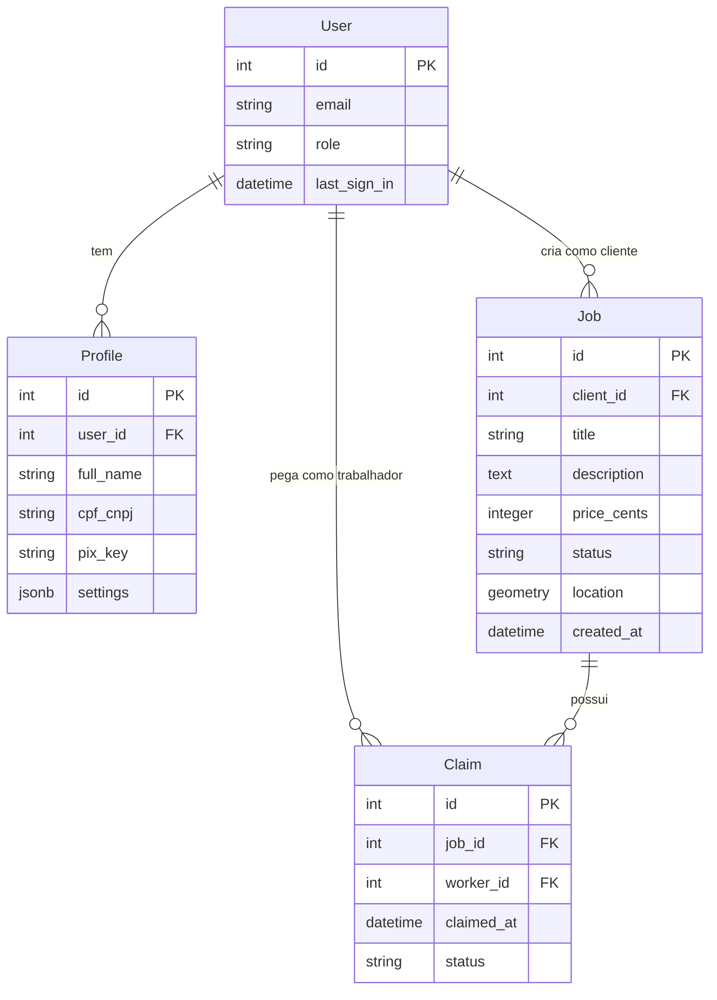
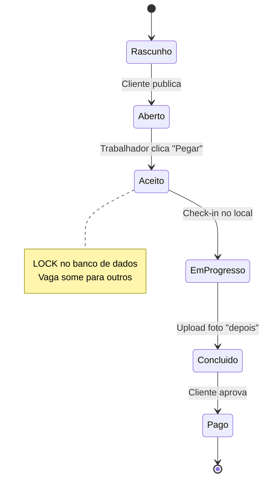
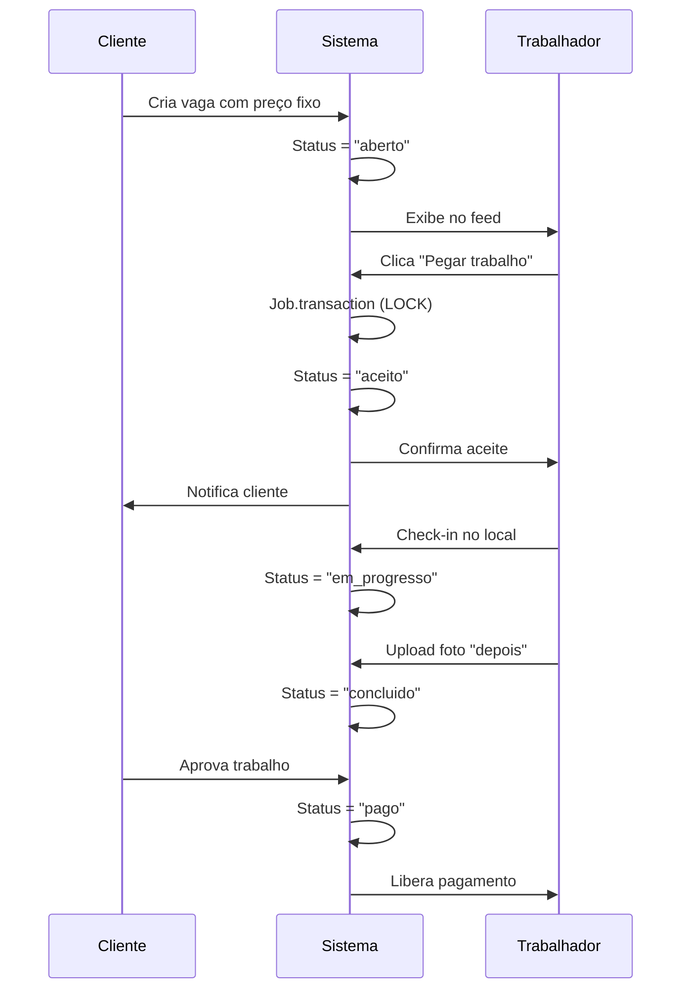

# MVP - Plataforma de Trabalho Digno

## Conceito

Plataforma worker-first sem leilão de preços. O trabalhador escolhe o trabalho pelo preço justo definido pelo cliente.

## Prioridades (MoSCoW)

### 🔴 Must Have

- **Autenticação**: Login separado para Cliente e Trabalhador
- **Criar Vaga**: Título, descrição, preço fixo, fotos, localização (CEP)
- **Feed de Vagas**: Lista ordenada por data/proximidade
- **Sistema de Claim**: Primeiro que clica leva (lock no banco)
- **Fluxo de Status**: Aberto → Aceito → Em Progresso → Concluído → Pago

### 🟡 Should Have

- **Comunicação**: Botão WhatsApp ou chat simples ActionCable
- **Upload "Depois"**: Foto obrigatória para liberar pagamento

### 🔵 Could Have

- **IA Gemini**: Orçamento por voz + assistente jurídico (V2)
- **Pix Automático**: Inicialmente manual com comprovante

## Arquitetura

### Modelo de Dados



### Fluxo de Estados



### Fluxo de Usuário



## Design UX

### Princípios

- **Botões grandes**: `w-full p-4 text-xl`
- **Alto contraste**: Cards brancos em fundo cinza
- **Hierarquia clara**: Preço e distância em destaque
- **Acessibilidade**: Texto grande, linguagem simples

### Telas Principais

1. **Feed do Trabalhador**: Cards com título, preço, distância, botão "Pegar"
2. **Detalhes da Vaga**: Fotos, descrição completa, localização, botão de ação
3. **Painel do Cliente**: Criar vaga, ver status, aprovar conclusão

## Implementação

### Setup Inicial

```bash
rails new app_pedreiros --css=tailwind --javascript=bun
```

### Scaffold Principal

```bash
rails g scaffold Job title:string description:text price_cents:integer status:string client:references
rails g model Claim job:references worker:references claimed_at:datetime status:string
```

### Lógica Crítica: Claim Atômico

```ruby
# app/controllers/claims_controller.rb
def create
  Job.transaction do
    @job = Job.lock.find(params[:job_id])

    if @job.status == 'open'
      @claim = @job.claims.create!(
        worker: current_user,
        claimed_at: Time.current,
        status: 'active'
      )
      @job.update!(status: 'claimed')
      redirect_to @job, notice: 'Trabalho aceito!'
    else
      redirect_to jobs_path, alert: 'Vaga já foi preenchida'
    end
  end
end
```

## Próximos Passos

1. Implementar models com validações
2. Criar controllers com lógica de claim
3. Desenvolver views com Tailwind
4. Adicionar geolocalização (geocoder gem)
5. Implementar upload de fotos (Active Storage)
6. Testes de race condition no claimid
        int worker_id
        datetime claimed_at
        string status "active, disputed, completed"
    }

    Job ||--o{ Claim : possui
B. Máquina de Estados do Trabalho (The Happy Path)

O segredo para evitar a "platamorfização" é este fluxo linear.

Snippet de código
stateDiagram-v2
    [*] --> Rascunho
    Rascunho --> Aberto: Cliente Publica (Dinheiro Retido*)
    Aberto --> Aceito: Trabalhador clica em "Pegar"
    note right of Aceito
        Aqui acontece o LOCK no banco de dados.
        Outros trabalhadores não veem mais a vaga.
    end note
    Aceito --> Em_Progresso: Check-in no local
    Em_Progresso --> Concluido: Upload foto "Depois"
    Concluido --> Pago: Cliente aprova
    Pago --> [*]
3. Wireframes e Sketches (Visualização)

Como você pediu para "ver" as telas para iniciar o trabalho, vou usar a ferramenta de geração de imagem para criar rascunhos de baixa fidelidade (wireframes) das duas telas mais críticas.

O que vou gerar:

O Feed do Trabalhador ("O Quadro de Vagas"): Foco em legibilidade, preços claros e o botão de ação.

A Tela de Detalhe da Vaga (A Ação de "Claim"): Onde a decisão acontece.

Vou gerar essas imagens agora. Aqui estão os wireframes para guiar o seu desenvolvimento frontend. Foquei na simplicidade e acessibilidade, pensando em usuários como o seu pai, que precisam de informações grandes e claras, sem "enfeites" desnecessários que distraiam do valor (o trabalho e o preço).


Notas de Design para o seu CSS (Tailwind):

Botões Gigantes: Note como a ação principal deve ocupar a largura total (w-full p-4 text-xl).

Contraste: Use bg-white para os cards sobre um fundo bg-gray-100 para criar profundidade sem sombras complexas.

Hierarquia: O Preço e a Distância são as informações mais críticas depois do título. Dê destaque a elas (ex: text-green-700 font-bold).

Próximos Passos Práticos

Setup Inicial: Rode o comando para criar a base com o banco correto: rails new app_pedreiros --database=postgresql --css=tailwind --javascript=esbuild

Gerar o Scaffold do Job: Comece pelo objeto principal. rails g scaffold Job title:string description:text price_cents:integer status:string client:references

Implementar o "Claim" (O diferencial): Crie a rota e a controller action que fará o Job.transaction para mudar o status de open para claimed garantindo que não haja condição de corrida (race condition).

Quer que eu escreva o código da Migration e do Model do Job e do Claim para garantir essa transação atômica segura?